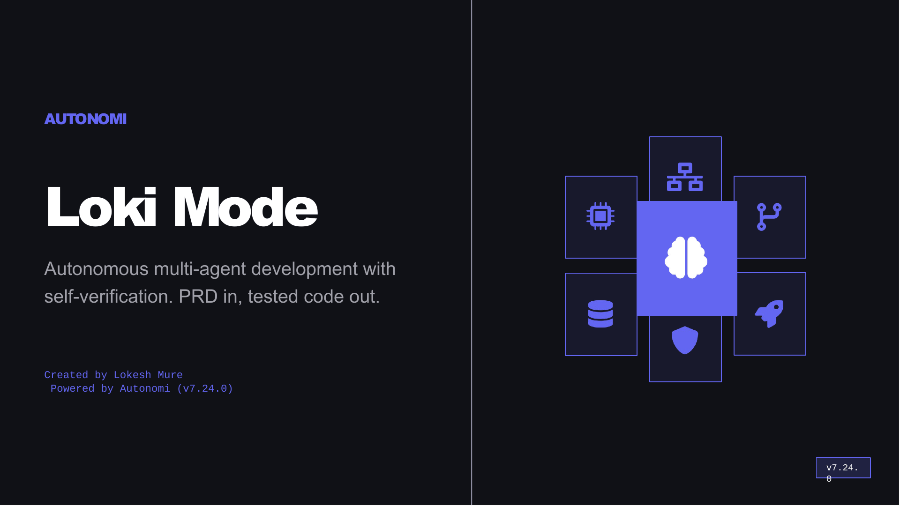

# Loki Mode

**Autonomous multi-agent development with self-verification. PRD in, tested code out.**

[](https://www.npmjs.com/package/loki-mode)
[](https://www.npmjs.com/package/loki-mode)
[](https://github.com/asklokesh/loki-mode)
[](LICENSE)
[]()
[](https://www.autonomi.dev/)
[](https://hub.docker.com/r/asklokesh/loki-mode)

**Current Version: v6.36.1**

### Traction

**744 stars** | **151 forks** | **12,700+ Docker pulls** | **477 npm downloads (last 7d)** | **641 commits** | **285+ releases published** | **30+ releases in 72 hours (March 17-19, 2026)**

---

## What Is Loki Mode?

Loki Mode is a multi-agent system that transforms a Product Requirements Document into a built and tested product. It orchestrates 41 specialized agent types across 8 swarms -- engineering, operations, business, data, product, growth, review, and orchestration -- working in parallel with continuous self-verification.

Every iteration follows the **RARV cycle**: Reason (read state, identify next task) -> Act (execute, commit) -> Reflect (update continuity, learn) -> Verify (run tests, check spec). If verification fails, the system captures the error as a learning and retries from Reason. This is the core differentiator: code is not "done" until it passes automated verification. See [Core Workflow](references/core-workflow.md).

**What "autonomous" actually means:** The system runs RARV cycles without prompting. It does NOT have access to your cloud accounts, payment systems, or external services unless you provide credentials. Human oversight is expected for deployment credentials, domain setup, API keys, and critical decisions. The system can make mistakes, especially on novel or complex problems.

### What To Expect

| Project Type | Examples | Typical Duration | Experience |
|---|---|---|---|
| Simple | Landing page, todo app, single API | 5-30 min | Completes independently. Human reviews output. |
| Standard | CRUD app with auth, REST API + React frontend | 30-90 min | Completes most features. May need guidance on complex parts. |
| Complex | Microservices, real-time systems, ML pipelines | 2+ hours | Use as accelerator. Human reviews between phases. |

### Limitations

| Area | What Works | What Doesn't (Yet) |
|------|-----------|---------------------|
| **Code Generation** | Full-stack apps from PRDs | Complex domain logic may need human review |
| **Deployment** | Generates configs, Dockerfiles, CI/CD workflows | Does not deploy -- human provides cloud credentials and runs deploy |
| **Testing** | 9 automated quality gates, blind review | Test quality depends on AI-generated assertions |
| **Multi-Provider** | Claude (full), Codex/Gemini/Cline/Aider (sequential only) | Non-Claude providers lack parallel agents and Task tool |
| **Enterprise** | TLS, OIDC, RBAC, audit trail | Self-signed certs only; some features require env var activation |
| **Dashboard** | Real-time status, task queue, agents | Single-machine only; no multi-node clustering |

---

## Quick Start

**Requirements:** Node.js 18+, Python 3.8+, macOS/Linux/WSL2, and at least one AI CLI (Claude Code, Codex, Gemini, Cline, or Aider).

### CLI Mode

```bash
npm install -g loki-mode
loki doctor                        # verify environment
loki start ./prd.md                # uses Claude Code by default
```

### Interactive Mode (inside Claude Code)

```bash
claude --dangerously-skip-permissions
# Then type: "Loki Mode" or "Loki Mode with PRD at ./my-prd.md"
```

This is the easiest way to try it if you already have Claude Code installed. No separate `loki` CLI installation needed.

### What Happens

The system classifies your PRD complexity, assembles an agent team, and runs RARV cycles with 9 quality gates. Output is committed to a Git repo with source code, tests, deployment configs, and audit logs. The dashboard auto-starts at `http://localhost:57374` for real-time monitoring, or use `loki status` from the terminal.

**Other install methods:** Homebrew (`brew tap asklokesh/tap && brew install loki-mode`), Docker, Git clone, VS Code Extension. See [Installation Guide](docs/INSTALLATION.md).

**Cost:** Loki Mode uses your AI provider's API. Simple projects typically consume modest token usage; complex projects with parallel agents use more. Monitor token economics with `loki memory economics`. See [Token Economics](references/memory-system.md) for details.

---

## BMAD Method Integration

Loki Mode integrates with the [BMAD Method](https://github.com/bmad-code-org/BMAD-METHOD), a structured AI-driven agile methodology. If your project uses BMAD for requirements elicitation (product briefs, PRDs, architecture documents, epic/story breakdowns), Loki Mode can consume those artifacts directly:

```bash
# Start from BMAD project artifacts
loki start --bmad-project ./my-project

# BMAD artifacts are discovered automatically from _bmad-output/
# PRD is analyzed with BMAD-aware scoring dimensions
# Architecture decisions are injected as execution context
# Epics/stories are loaded into the task queue
```

The adapter handles BMAD's frontmatter conventions, FR-format functional requirements, Given/When/Then acceptance criteria, and artifact chain validation. Non-BMAD projects are completely unaffected -- the integration is additive and opt-in via the `--bmad-project` flag.

See [BMAD Integration Validation](docs/architecture/bmad-integration-validation.md) for the compatibility analysis.

---

## Presentation



*9 slides: Problem, Solution, 41 Agents, RARV Cycle, Benchmarks, Multi-Provider, Full Lifecycle* | **[Download PPTX](docs/loki-mode-presentation.pptx)**

---

## Architecture


*Fallback: PRD -> Classifier -> Agent Team (41 types, 8 swarms) -> RARV Cycle <-> Memory System -> Quality Gates (pass/fail loop) -> Output*

See [full architecture documentation](docs/enterprise/architecture.md) for the detailed view.

**Key components:**

- **RARV Cycle** -- Reason-Act-Reflect-Verify with self-correction on failure. [Core Workflow](references/core-workflow.md)
- **41 Agent Types** -- 8 swarms auto-composed by PRD complexity. [Agent Types](references/agent-types.md)
- **9 Quality Gates** -- Blind review, anti-sycophancy, severity blocking, mock/mutation detection. [Quality Gates](skills/quality-gates.md)
- **Memory System** -- Episodic, semantic, procedural tiers with progressive disclosure. [Memory Architecture](references/memory-system.md)
- **Dashboard** -- Real-time monitoring, API v2, WebSocket at port 57374. [Dashboard Guide](docs/dashboard-guide.md)
- **Enterprise Layer** -- OTEL, policy engine, audit trails, RBAC, SSO (requires env var activation). [Enterprise Guide](docs/enterprise/architecture.md)

---

## Features

| Category | Highlights | Docs |
|---|---|---|
| **Agents** | 41 types across 8 swarms, auto-composed by PRD complexity | [Agent Types](references/agent-types.md) |
| **Quality** | 9 gates: blind review, anti-sycophancy, mock/mutation detection | [Quality Gates](skills/quality-gates.md) |
| **Dashboard** | Real-time monitoring, API v2, WebSocket, auto-starts with `loki start` | [Dashboard Guide](docs/dashboard-guide.md) |
| **Memory** | 3-tier (episodic/semantic/procedural), knowledge graph, vector search | [Memory System](references/memory-system.md) |
| **Providers** | Claude (full), Codex/Gemini/Cline/Aider (sequential) | [Provider Guide](skills/providers.md) |
| **Enterprise** | TLS, OIDC/SSO, RBAC, OTEL, policy engine, audit trails | [Enterprise Guide](docs/enterprise/architecture.md) |
| **Integrations** | Jira, Slack, Teams, GitHub Actions (Linear: partial) | [Integration Cookbook](docs/enterprise/integration-cookbook.md) |
| **Deployment** | Helm, Docker Compose, Terraform configs (AWS/Azure/GCP) | [Deployment Guide](deploy/helm/README.md) |
| **Web App** | Replit-like UI with 10 React components, PRD input, agent dashboard, file browser, memory viewer | [Dashboard Guide](docs/dashboard-guide.md) |
| **Cost Estimation** | Pre-execution analysis with complexity scoring, token/cost projection | [Memory System](references/memory-system.md) |
| **Auto-Failover** | Cross-provider failover (Claude -> Codex -> Gemini) when rate limited | [Provider Guide](skills/providers.md) |
| **SDKs** | Python (`loki-mode-sdk`), TypeScript (`loki-mode-sdk`) | [SDK Guide](docs/enterprise/sdk-guide.md) |

### Multi-Provider Support

| Provider | Install | Autonomous Flag | Parallel Agents |
|----------|---------|-----------------|-----------------|
| Claude Code | `npm i -g @anthropic-ai/claude-code` | `--dangerously-skip-permissions` | Yes (10+) |
| Codex CLI | `npm i -g @openai/codex` | `--full-auto` | No (sequential) |
| Gemini CLI | `npm i -g @google/gemini-cli` | `--approval-mode=yolo` | No (sequential) |
| Cline CLI | `npm i -g @anthropic-ai/cline` | `--auto-approve` | No (sequential) |
| Aider | `pip install aider-chat` | `--yes-always` | No (sequential) |

Claude gets full features (subagents, parallelization, MCP, Task tool). All other providers run in sequential mode -- one agent at a time, no Task tool. See [Provider Guide](skills/providers.md) for the full comparison.

---

## CLI

| Command | Description |
|---------|-------------|
| `loki start [PRD]` | Start with optional PRD file |
| `loki stop` | Stop execution |
| `loki pause` / `resume` | Pause/resume after current session |
| `loki status` | Show current status |
| `loki dashboard` | Open web dashboard |
| `loki doctor` | Check environment and dependencies |
| `loki import` | Import GitHub issues as tasks |
| `loki memory <cmd>` | Memory system CLI (index, timeline, search, consolidate) |
| `loki enterprise` | Enterprise feature management (tokens, OIDC) |
| `loki plan [PRD]` | Pre-execution analysis: complexity scoring, cost estimation, iteration prediction |
| `loki review [--staged\|--diff]` | AI-powered code review with 4 quality gates, severity filtering, CI output |
| `loki onboard [path]` | Instant project analysis and CLAUDE.md generation (12+ config types, 3 depth levels) |
| `loki ci` | CI/CD quality gate integration (GitHub Actions, GitLab CI, Jenkins, CircleCI) |
| `loki test [--file\|--dir\|--changed]` | AI-powered test generation (8 languages, 9 frameworks) |
| `loki failover [status\|--enable\|--chain]` | Cross-provider auto-failover when primary hits rate limits |
| `loki web` | Launch the web app (Replit-like UI for visual PRD-to-code workflow) |
| `loki version` | Show version |

Run `loki --help` for all commands. Full reference: [CLI Reference](wiki/CLI-Reference.md) | Configuration: [config.example.yaml](autonomy/config.example.yaml)

---

## Enterprise

Enterprise features are included but require env var activation. Self-audit results: 35/45 capabilities working, 0 broken, 1,314 tests passing (683 npm + 631 pytest). 2 items partial, 3 scaffolding (OTEL/policy active only when configured). See [Audit Results](.loki/audit/integrity-audit-v5.52.0.md).

```bash
export LOKI_TLS_ENABLED=true
export LOKI_OIDC_PROVIDER=google
export LOKI_AUDIT_ENABLED=true
export LOKI_METRICS_ENABLED=true
loki enterprise status               # check what's enabled
loki start ./prd.md                   # enterprise features activate via env vars
```

[Enterprise Architecture](docs/enterprise/architecture.md) | [Security](docs/enterprise/security.md) | [Authentication](docs/authentication.md) | [Authorization](docs/authorization.md) | [Metrics](docs/metrics.md) | [Audit Logging](docs/audit-logging.md) | [SIEM](docs/siem-integration.md)

---

## Benchmarks

Results from the included test harness. Self-reported and not independently verified. Verification scripts included so you can reproduce. See [benchmarks/](benchmarks/) for methodology.

| Benchmark | Result | Notes |
|-----------|--------|-------|
| HumanEval | 162/164 (98.78%) | Max 3 retries per problem, RARV self-verification |
| SWE-bench | 299/300 patches generated | Patch generation only -- SWE-bench evaluator not yet run to confirm resolution |

---

## Research Foundation

| Source | What We Use From It |
|--------|---------------------|
| [Anthropic: Building Effective Agents](https://www.anthropic.com/research/building-effective-agents) | Evaluator-optimizer pattern, parallelization strategy |
| [Anthropic: Constitutional AI](https://www.anthropic.com/research/constitutional-ai-harmlessness-from-ai-feedback) | Self-critique against quality principles |
| [DeepMind: Scalable Oversight via Debate](https://deepmind.google/research/publications/34920/) | Debate-based verification in council review |
| [DeepMind: SIMA 2](https://deepmind.google/blog/sima-2-an-agent-that-plays-reasons-and-learns-with-you-in-virtual-3d-worlds/) | Self-improvement loop design |
| [OpenAI: Agents SDK](https://openai.github.io/openai-agents-python/) | Guardrails, tripwires, tracing patterns |
| [NVIDIA ToolOrchestra](https://github.com/NVlabs/ToolOrchestra) | Efficiency metrics, reward signal tracking |
| [CONSENSAGENT (ACL 2025)](https://aclanthology.org/2025.findings-acl.1141/) | Anti-sycophancy checks in blind review |
| [GoalAct](https://arxiv.org/abs/2504.16563) | Hierarchical planning for complex PRDs |

**Practitioner insights:** Boris Cherny -- self-verification loop patterns | Simon Willison -- sub-agents for context isolation | [HN Community](https://news.ycombinator.com/item?id=44623207) -- production patterns from real deployments

**[Full Acknowledgements](docs/ACKNOWLEDGEMENTS.md)** -- 50+ research papers, articles, and resources

---

## Contributing

```bash
git clone https://github.com/asklokesh/loki-mode.git && cd loki-mode
npm install && npm test              # 683 tests, ~10 sec
python3 -m pytest                    # 631 tests, ~3 sec
bash tests/run-all-tests.sh          # shell tests, ~2 min
```

See [CONTRIBUTING.md](CONTRIBUTING.md) for guidelines.

## License

Business Source License 1.1 -- see [LICENSE](LICENSE) and [LICENSE-CHANGE-NOTICE.md](LICENSE-CHANGE-NOTICE.md).

Free for personal, internal, academic, and non-commercial use. Commercial use that competes with Loki Mode requires a separate license. Converts to Apache 2.0 on March 19, 2030. Contact founder@autonomi.dev for commercial licensing.

---

[Autonomi](https://www.autonomi.dev/) | [Documentation](wiki/Home.md) | [Changelog](CHANGELOG.md) | [Installation](docs/INSTALLATION.md) | [Comparisons](references/competitive-analysis.md)
